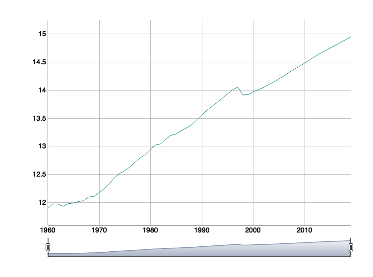
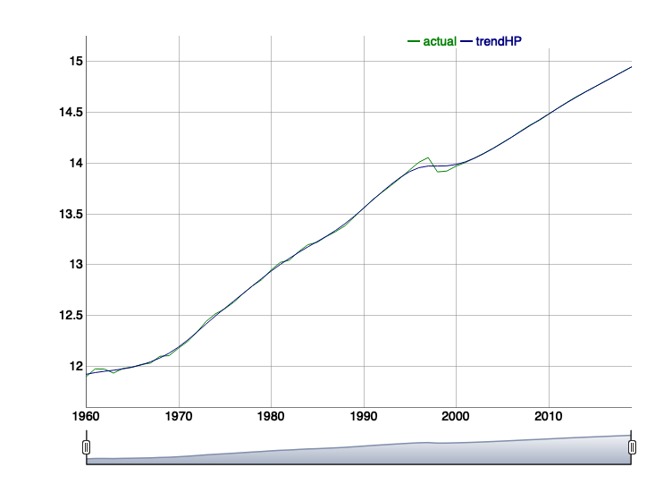
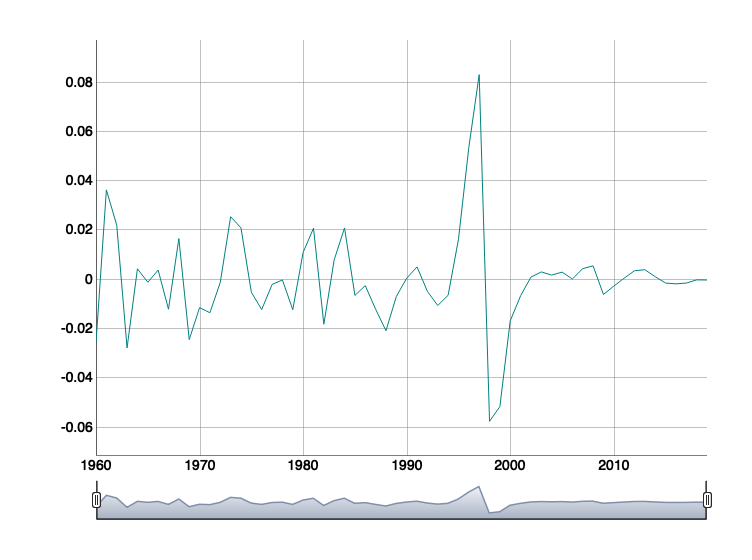
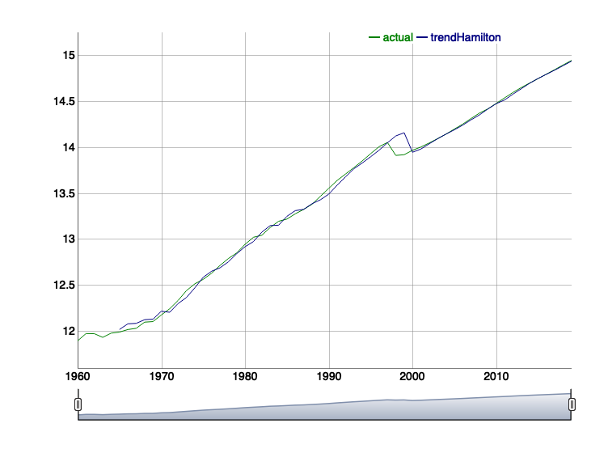
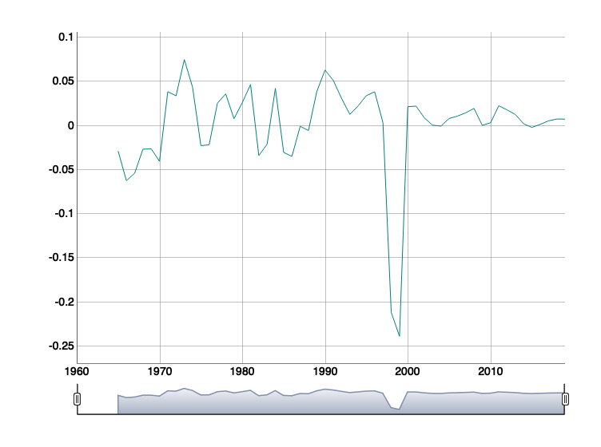

RStudio: [](http://mybinder.org/v2/gh/quarcs-lab/tutorial-long-run-filters/main?urlpath=rstudio)

# Long Run vs Short Run Decompositions in R:  The HP filter vs the Hamilton filter

- https://rpubs.com/quarcs-lab/573944

## Online Environments

- R Studio cloud project: https://rstudio.cloud/project/25043

- This notebook can also be executed online at [GESIS Notebooks](https://notebooks.gesis.org). Just copy the URL of this repository and paste it on the [BINDER form](https://notebooks.gesis.org/binder/) To open a virtual R Studio session, make sure you change you click on `File` and change it to `URL`. Then, write `rstudio` in the field `URL to open (optional)`. Finally, click on `launch`.  


[](http://creativecommons.org/licenses/by-sa/4.0/)

---

Suggested Citation:

> Mendez C. (2020). Long Run vs Short Run Decompositions in R: The HP
> filter vs the Hamilton filter. R Studio/RPubs. Available at
> <https://rpubs.com/quarcs-lab/long-run-filters>

---

# Tutorial

# Set parameters of the program

  - Name of the series

<!-- end list -->

``` r
seriesName <- "RGDPNAIDA666NRUG"
```

Code examples for other series

  - Total GDP of Japan: “JPNRGDPEXP”
  - GDP per capita of Japan: “RGDPCHJPA625NUPN”
  - GPD per capita of Bolivia: “NYGDPPCAPKDBOL”
  - Total GDP of Bolivia: “RGDPNABOA666NRUG”
  - Total GDP of Indonesia: “RGDPNAIDA666NRUG”

# Load libraries

``` r
library(mFilter)
library(quantmod)
library(dplyr)
library(ggplot2)
library(dygraphs)
library(xts)
library(neverhpfilter)

# Change the presentation of decimal numbers to 4 and avoid scientific notation
options(digits=3, scipen=999)
```

# Import data

``` r
seriesName <- getSymbols(seriesName, src="FRED", auto.assign = FALSE)
```

``` r
periodicity(seriesName)
```

    ## Yearly periodicity from 1960-01-01 to 2019-01-01

# Transform the data

  - Take the log of the series

<!-- end list -->

``` r
seriesName <- log(seriesName)
```

# Plot evolution of the variable

``` r
dygraph(seriesName) %>%
  dyRangeSelector()
```

<!-- -->

# Apply the HP filter

``` r
seriesName_filtered_HP <- hpfilter(seriesName,
                                  freq = 6.25      
                                     )
```

## Plot the HP filter

### Long-run trend

Create matrix of actual, trend , and cycle values

``` r
actual  <- seriesName_filtered_HP[["x"]]
trendHP <- seriesName_filtered_HP[["trend"]]
cycleHP <- actual - trendHP

colnames(actual)   <- c("actual")
colnames(trendHP)  <- c("trendHP")
colnames(cycleHP)  <- c("cycleHP")

actual_and_trend <- cbind(actual, trendHP)
```

``` r
dygraph(actual_and_trend[,1:2]) %>%
  dyRangeSelector()
```

<!-- -->

### Short-run fluctuations

``` r
dygraph(cycleHP)  %>%
  dyRangeSelector()
```

<!-- -->

# Apply the Hamilton filter

``` r
seriesName_filtered_Hamilton <- yth_filter(seriesName,
                                           h = 2,
                                           p = 4,
                                           output = c("x", "trend", "cycle"))
```

## Plot the Hamiltion filter

### Long-run trend

Rename columns

``` r
colnames(seriesName_filtered_Hamilton)  <- c("actual",
                                             "trendHamilton",
                                             "cycleHamilton")
```

``` r
dygraph(seriesName_filtered_Hamilton[,1:2])  %>%
  dyRangeSelector()
```

<!-- -->

### Short-run fluctuation

``` r
dygraph(seriesName_filtered_Hamilton[,3])  %>%
  dyRangeSelector()
```

<!-- -->

# Run it in the cloud

Tip: Copy and paste this link another tab of your browser.

<https://rstudio.cloud/project/25043>

Or simply
<a href="https://rstudio.cloud/project/25043" target="_blank">ClickHERE</a>
